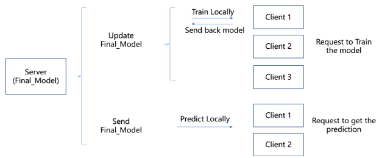
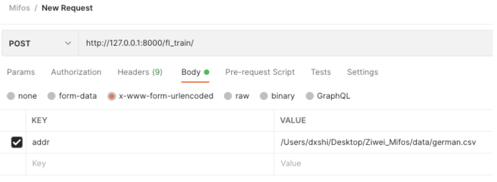
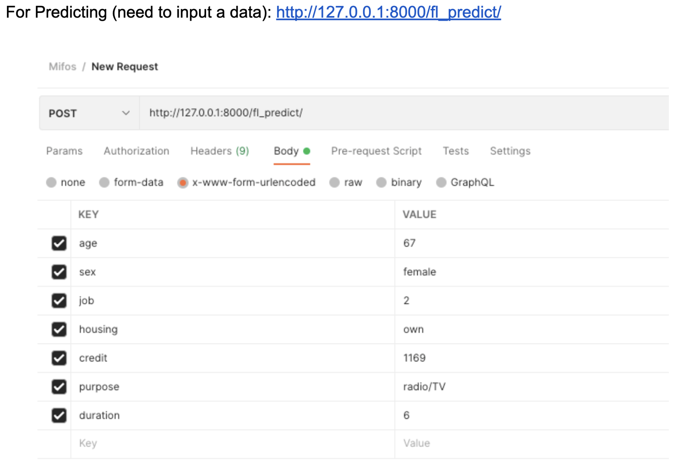

# Summary report of Machine Learning Scorecard Phase - 5

## Introduction
The Machine Learning Scorecard Phase - 5 is a project listed as a part of the GSoC’22 program. The project involves making significant improvements to the existing loan and credit scoring system by exploiting the use of machine learning, pipelines and modern statistical models. It also aims to demonstrate the use of federated learning which will make the suite future-compliant with data privacy rules. With the completion of this project, the credit scoring system in the fineract suite will be transformed into a very strong part of the loan application module.

## Process of program
Our project is mainly divided into two steps.

Step 1: Initially, we want to use OpenMined/PySyft to implement federated learning function. And we successfully build a simulation demo on the jupyter notebook. However, when we want to transfer the implementation to the python file, because of the lifetime of the Duet module used by the PySyft, we are failed to do that.

Simulation demo:
https://github.com/Zavier-opt/fineract-federatedLearning-research/tree/main/FL_Simulation

Python file using PySyft (couldn’t run successfully):
https://github.com/Zavier-opt/fineract-federatedLearning-research/tree/main/FL_BuildConnection 
	
Step 2: Then we used another framework, Flower, to implement federated learning. We also built a simulation demo. And then we successfully deploy it using the Django framework. Here is a diagram showing how the federated learning function works. There are two functions: Training and Predicting. In the training process, the server will use the client’s data to train the model on the client’s side. After training, the model will be sent back to the server to update the model on the server’s side. In the prediction process, the model will be pulled to the client side to be used for making the prediction.

## The composition of the function
For achieving the federated learning function, we need to establish the server side and the client side.
### Server
The server is mainly responsible for controlling the training process, and recording the prediction model. Here is the link to the server code:
https://github.com/Zavier-opt/fineract-federatedLearning-research/blob/main/flower/FL_Simulation/server.py

### Client
The client is responsible for training the model locally under the control of the server. And client side is deployed on the Django rest framework. It is created as a new app(fl_learning) to the previous credit scorecard Django project. Here is the link to the client code:
https://github.com/Zavier-opt/fineract-credit-scorecard/tree/develop/fl_learning

This fl_learning app is mainly composed by these files:
1. views.py: Provides the predict and train function. This is the core of this federated learning function.
2. fl_model.py: Defines the prediction model, training process and flower model.
3. fl_utility.py: Provides utility functions.
4. urls.py: Define the API.

## Requirements
In this project, we use the Flower library(**flwr 0.19.0**) to achieve the federated learning function.
    

## Description of how it works
First, we need to run the server code to start the federated learning server. Next, on the client side, after finishing the instructions to run application from https://github.com/apache/fineract-credit-scorecard#readme ,we can use the command `python manage.py runserver`  to start the Django engine. Now the client backend side 
prepares to accept two post APIs:

For training:\
&emsp;&emsp; http://127.0.0.1:8000/fl_train/
&emsp;&emsp; Describe: Train the model based on the provided dataset.\
&emsp;&emsp; Method: Post\
&emsp;&emsp; Parameters: The address of the dataset, which should include the key: *addr*

For preidction:\
&emsp;&emsp;    http://127.0.0.1:8000/fl_predict/
&emsp;&emsp; Describe: Get the prediction of a given data.\
&emsp;&emsp; Method: Post\
&emsp;&emsp; Parameters: The input data, which should include these keys: *age*, *sex*, *job*, *housing*, *credit*, *purpose*, *duration*.

Then, we can use these two APIs to call the training and prediction functions.

## Future of Work
There are several remaining works in the future.
1. The current work is an attempt to use federated learning in predicting the users' credit. Our work now can only accept one client to connect at one time. This is a limitation.
2. Our current work is not very strict at protecting data privacy, because we allow the server to record the trained model. We can try to think about other libraries such as FATE and FedAI.
3. Further discussion about what the input data should be, and which features should be used to train the model is necessary